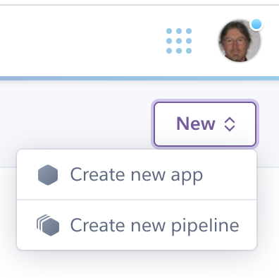
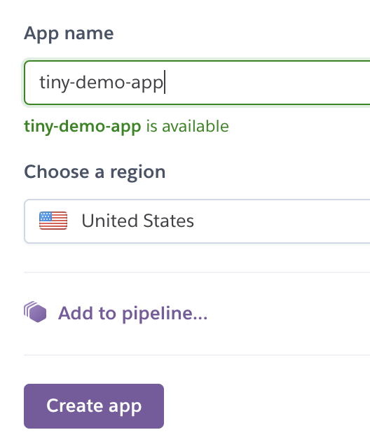
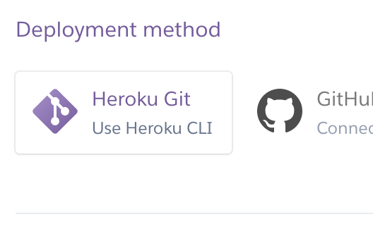
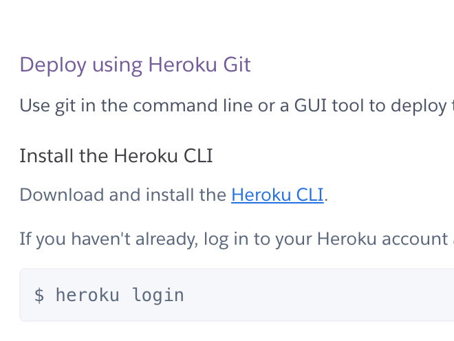
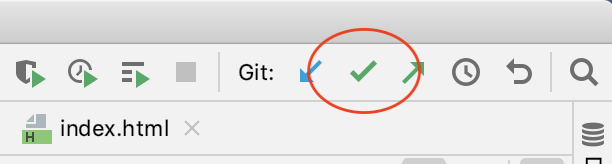
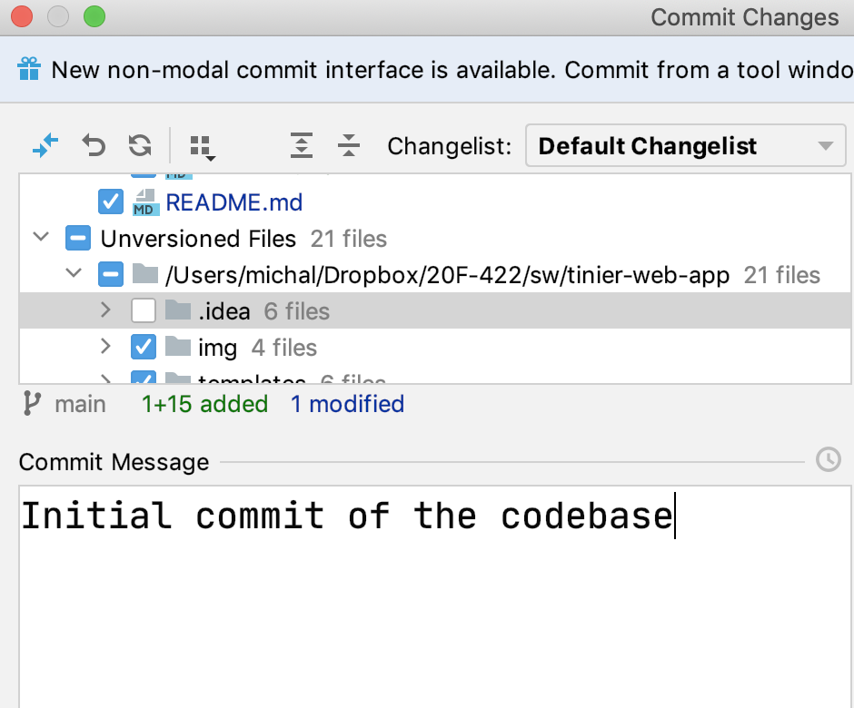

# tinier-web-app
Another minimal Flask application, this time with a form but without a database

## Steps I took to create it

Here is a brief description of how I put this together
and prepared it for Heroku. 

First I created the git repository.  I chose to make
it public, with a .gitignore for Python, and with 
a README.md (but without filling that in yet).  I chose 
the Apache v2 license. 

## Initialize on development machine

I copied the git URL from github, and cloned it on
my development laptop using PyCharm.  (Usually I clone
in a terminal window instead and then open in PyCharm, 
but cloning directly in PyCharm just saves one step.)

PyCharm initially configured the project with my default
Python interpreter.  For cloud deployment I need instead
to have a virtual environment (venv) so that I can put
needed libraries there for Flask.  I used the PyCharm 
preferences to create a new "interpreter" configuration. 
I then installed Flask in the virtual environment. The 
following command is given in the terminal window: 

```
(env) Sparrowhawk:tinier-web-app michal$ pip3 install flask
Collecting flask
  Using cached Flask-1.1.2-py2.py3-none-any.whl (94 kB)
...
```
I want to give Heroku a recipe for recreating this
virtual environment with Flask installed, so I create
a `requirements.txt` file. 

```
(env) Sparrowhawk:tinier-web-app michal$ pip freeze >requirements.txt
```

Now `requirements.txt` contains the full list of 
needed libraries and versions for this project. 
I could cut it down a bit in an editor, but I won't
bother for now. 

## Copy a skeleton

I never write code from scratch if I can start with
a copy of something that at least has the right 
skeleton.  I'm going to start this one by copying
parts of my 
`MinimumWebApp` project, then stripping out
the parts I need to change. 

```
(env) Sparrowhawk:tinier-web-app michal$ cp ../MinimumWebService/*.py .
```

Now I've got a copy of `flask_main.py` and `CONFIG.base.py`. 
The configuration tactic isn't a good fit for Heroku, 
so I'll change that shortly.  For now I want to focus
on the main Flask program.  Currently it imports a 
database module.  I'll delete that.  

I want this little project to demonstrate processing
a form with Flask.  Therefore I want the top-level 
URL, `/` or `/index`, to display the form. 

```python
@app.route("/")
@app.route("/index")
def index():
  return flask.render_template('form.html')
``` 

The `@app.route("url")` lines are Python "decorators". 
Decorators are functions that can create "wrapped"
versions of the functions that follow.  The `@app.route`
decorator does not modify the following function
(`index`), but places it in a table.  In web applications, 
"routes" associations of URLs with functions
that respond to those URLs.  

A URL has multiple parts.  In

```
http://some.host.com:9999/my/web/app?confused=yes
```

`http` (or `https`) is the "scheme", `some.host.com`
is the internet address (IP address), `9999` is the
port number (which defaults to 80 for the `http` scheme), 
`/my/web/app` is the "path", and `confused=yes` is a 
"parameter".  The `@app.route` decorator maps 
the "path" part of the URL to a function. 

Flask expects to find a template for `form.html`
in a subdirectory called `templates`.  Ever lazy, 
I'll start by copying that from the old project: 

```
(env) Sparrowhawk:tinier-web-app michal$ cp -r ../MinimumWebService/templates .
```

There happens to already be a `form.html` file in that
directory.  It's not the *right* form, but it's a
form, so I'll just edit that instead of starting from
scratch. 

The copied templates directory also includes several
pages that are displayed when particular errors occur. 
I'll keep `403.html` (forbidden), `404.html` (not found), 
and `500.html` (server error).  I'll get rid of 
`index.html` (the old start page) and modify `display.html`
to show the form result. 

There are several tutorials on uploading files in 
Flask.  I'm going to rely mainly on the summary
in the Flask documentation, 
`https://flask.palletsprojects.com/en/1.1.x/patterns/fileuploads/`. 

I'll start with the html form.  My starter already
has a `<form>` element: 

```
<form id="nanotweet" method="POST" action="_ranted">
```

I'll give it a more appropriate name (`demo_upload`)
and action (`_upload`).  I will also strip out the 
existing form fields, but keep the `submit` button:

```html
<form id="upload_demo" method="POST" action="_upload">
  <input type="submit" value="Submit" />
</form>
```

I need to add one field to this form, for the 
file upload.  The documentation also shows a
`enctype=multipart/form-data` parameter for the 
form, so I'll add that, and I'll put a label on 
the file upload field so that it isn't a total mystery. 

```html
<form id="upload_demo" method="POST" action="_upload"
     enctype="multipart/form-data">
  <label for="the_file">Upload a file:</label>
  <input id="the_file" type=file name=file>
  <input type="submit" value="Submit" />
</form>
```

I haven't written any code for handling the form
submission, but at this point I should at least be
able to display the form and submit it. After renaming
`CONFIG.base.py` to `config.py` and changing 
several instances of `CONFIG` to `config` in
`flask_main.py`, it works (sort of). 

```
 * Debug mode: on
 * Running on http://0.0.0.0:5000/ (Press CTRL+C to quit)
 * Restarting with stat
Opening for global access on port 5000
 * Debugger is active!
 * Debugger PIN: 196-091-943
```

It is very basic, but there is a `Choose File` button
and a `Submit` button.  I can select a file and 
press the `Submit` button, but then I get a 
404 (page not found) error, because my flask program
does not yet have the `_upload` URL mapped to a 
function.  Time to fix that. 

## Handling the file submission 

The old `flask_main` program had a route for handling
form submission, but it handled a text input field. 

```python
@app.route("/_ranted", methods=['POST'])
def ranted():
```

I'll start with that, but now the URL path (which 
I set with `action="_upload"` in the html) is 
`_upload`: 

```python
@app.route("/_upload", methods=['POST'])
def upload():
  app.logger.debug("Uploaded form")
```

For the body of this function, I refer to the flask 
documentation.  It strongly warns me to restrict 
the file types and length and to rename the file and
put it in a safe place.   OK then ... 

```python
from werkzeug.utils import secure_filename
import os
import tempfile
UPLOAD_FOLDER = tempfile.gettempdir()
ALLOWED_EXTENSIONS = {'txt', 'gpx'}

... 

#################
# Handle a file upload
#################

@app.route("/_upload", methods=['POST'])
def upload():
    app.logger.debug("Uploaded form")
    if 'file' not in flask.request.files:
        app.logger.debug("file not in request.files")
        flask.flash('No file part')
        return flask.redirect(flask.url_for("index"))
    file = flask.request.files['file']
    # if user does not select file, browser also
    # submit an empty part without filename
    if file.filename == '':
        app.logger.debug("file.filename is empty")
        flask.flash('No selected file')
        return flask.redirect(flask.url_for("index"))
    if not allowed_file(file.filename):
        app.logger.debug(f"Rejecting file name {file.filename}")
        flask.flash(f'File name "{file.filename}" not permitted')
        return flask.redirect(flask.url_for("index"))
    ## Passed all checks
    app.logger.debug("Looks like there is a valid file name")
    filename = secure_filename(file.filename)
    full_path = os.path.join(UPLOAD_FOLDER, filename)
    app.logger.debug(f"Saving the file to {full_path}")
    file.save(full_path)
    flask.g.result = do_something(full_path)
    app.logger.debug("Rendering result")
    return flask.render_template("display.html")

def allowed_file(filename: str) -> bool:
    return '.' in filename and \
           filename.rsplit('.', 1)[1].lower() in ALLOWED_EXTENSIONS

def do_something(path: str) -> str:
    """This is where I would call a function
    that reads the uploaded file and returns something
    """
    f = open(path, "r")
    text = f.readlines()
    return "\n".join(text)
```

## On Heroku, files go away

The body of `upload` is mostly copied from the 
flask documentation, but there is one very important
difference:  I am processing the file immediately 
instead of redirecting the browser to a different 
URL to process it. To understand why, we need to know
a little bit about how Heroku works.  

Heroku may run several copies of your application
in different "dynos", which are basically virtual 
machines or containers (similar to Docker containers). 
Each of these dynos has its own ephemeral file system. 
When we save the uploaded file, we are saving to one
of these ephemeral file systems.  If we redirect to
a different URL, it might be processed by a copy of
your app on a different dyno, and the file you just
saved would not be there.  If we needed to keep that
file around and make it available to all copies of
your web app, we would need to store it elsewhere, 
perhaps in an external database or 
(as Heroku documentation suggests) using a separate
web service from Amazon.  Double double, toil and trouble, 
I do not want that extra combination.  

Since we only
need this file long enough to process it once, I
am just calling `do_something` within the URL 
handler function `_upload` and using the result
directly to produce data used in rendering a
new page.  

## Creating the display page 

Flask maintains an object called `g` (for "global")
that we can use to gather up information to be used
on a web page.  The `g` object lasts only during
one http request/response cycle, but during that 
processing it is accessible to all functions. 
We can think of the `g` object as a dict or as
a object, but we save information in it using 
the dot syntax like an object: 

```python
        flask.g.result = do_something(full_path)
```

The `g` object is also accessible to the Jinja2
rendering engine that converts page templates to
complete pages, so we can use it in 
`templates/display.html`, like this: 

```html
<!DOCTYPE HTML>
<html lang="en">
  <head>
    <meta charset="utf-8">
    <title>Amazing results!</title>
  </head>
  <body>
    <h1>Here is what we got</h1>
    <p>{{ g.result }}</p>
  </body>
</html>
```

The `{{` and `}}` surround a bit of code that produces a value to
insert at that point in the surrounding html.   The permitted code
is basically Python, although you cannot place big blocks of Python
code there.  For more complex template filling, you need to use
the constructs provided by Jinja2, which include conditionals and 
loops that are not quite pythonic.  

Time for more debugging!  And in fact there were 
several bugs in my code, but it would be confusing
if I showed you my buggy code first and then corrected
it, so what I have done instead is replaced the 
code snippets above with corrected code.   So now
I can pretend that this worked. 

## Getting it onto Heroku 

Now we've got a very basic web form with file upload
working in the development environment.  To run it on
Heroku, we'll need to 

* Create the extra files that tell Heroku how to run it

* Create an application on Heroku 

* Direct git to send our codebase to Heroku 

## The Heroku instruction files 

Heroku needs to know how to install and run the
application, including which (exact) version of Python
to use.  The version of Python is included in a "buildpack",
which is specified in a file called "runtime.txt".  I'll 
copy that from a prior project: 

```
(env) Sparrowhawk:tinier-web-app michal$ cp ../MinimumWebService/runtime.txt .
```

The file is a single line.  It must list one of the
buildpacks that Heroku currently supports.  There are
ways to combine buildpacks (e.g., some version of Python 
together with some version of NodeJS), but for us 
Python will be enough. 

```
python-3.8.6
```

On my development platform I have been testing with
the built-in flask server.  That isn't suitable for
running on Heroku ... we'll want a WSGI server that
can manage multiple copies of our app, handle crashes, etc. 
Green Unicorn (`gunicorn`) is a good choice.  I'll
install that locally and save the version in my
`requirements.txt` file. 

```
(env) Sparrowhawk:tinier-web-app michal$ pip3 install gunicorn
... 
Successfully installed gunicorn-20.0.4
(env) Sparrowhawk:tinier-web-app michal$ pip freeze >requirements.txt
```

Now we need to give Heroku instructions on how to
launch our application.  We'll specify that it is
a web app, and that it should execute Green Unicorn
with a command to run the `app` object in `flask_main.py`. 

```
web: gunicorn flask_main:app  --log-file -
```

This is in a file called `Procfile`, which I can also
copy from the prior project.  I also tried the
Green Unicorn command on my development machine to make
sure it would work.   (It did.)

## Creating the Heroku application 

I cannot recreate all of the steps on Heroku
completely from memory, since it was several years
ago when I created my account.  I do not think I
provided a credit card, but I'm not certain, and in
any case the procedures could have changed by now. 

Once you have created an account, you can create a project. 



We need to give it a name.  This one will be 
`tiny-demo-app.herokuapp.com`. 



There is more than one way to send our codebase
to Heroku.  The one I am familiar with is using
Heroku as a git target, so that's what I'll use. 



To use this method, you will need to install
Heroku command line interface (CLI) tools on
your development machine.  The directions are on
the same page as the choice of deployment method. 
However, do not create the new empty git repository
as instructed; we already have a non-empty git
repository that we want to use. 



We do follow the next instruction, which is to add
Heroku as a "remote" for our git repository.  This 
means that we can push files both to github
(`git push` will push to github by default)
and to Heroku (`git push heroku master` will
specify that we are pushing to Heroku). 

## Push and test

We need to add our codebase to git with the usual
`git add` command and commit.  I find the git
controls in PyCharm more convenient for adding
several files without accidentally adding things
that should not be in the repo.  






## Let it rip! 

Our app will be built when we push it to Heroku. 

```
(env) Sparrowhawk:tinier-web-app michal$ git push heroku main
```

Heroku will print several progress report messages, 
then 

```
remote:        Released v3
remote:        https://tiny-demo-app.herokuapp.com/ deployed to Heroku
remote: 
remote: Verifying deploy... done.
To https://git.heroku.com/tiny-demo-app.git
 * [new branch]      main -> main
```

If we click the link on the line that says 
"deployed to Heroku", we can see that it worked,
or else receive an error message about the app
crashing. 


